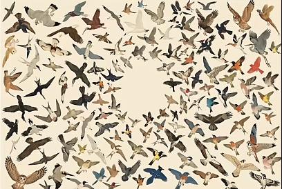

# Bird Calendar

A location-aware, **artistic** bird calendar. Point it at where you are and it paints the birds
around you — either the species most likely to be present, or the migrants currently moving
through. The neural network runs **entirely in your browser**; there is no backend.



## Two modes

| Mode | Shows | Bird size encodes | Pose |
|------|-------|-------------------|------|
| **A — Residents / Presence** | Species most likely at your location this week | Occurrence **probability** | **Sitting** birds |
| **B — Migration** | Migrants increasing (arriving) or decreasing (departing) | **Arrival score** (change in numbers) | **Flying** birds |

Birds are composited as transparent cutouts into a loose, radial scatter around an empty centre
(see the layout sketch above). Each species has several cutouts that are cycled at random on load,
so no two views look quite the same.

## How it works

The brain is the [BirdNET Geomodel](https://github.com/birdnet-team/geomodel), a small neural
network that predicts occurrence probabilities for **12,012 species** from
`(latitude, longitude, week 1–48)`. The calendar runs it client-side via
[ONNX Runtime Web](https://onnxruntime.ai/docs/tutorials/web/):

1. **Locate** — browser geolocation gives `(lat, lon)`; today's date maps to a BirdNET week (1–48).
2. **Predict** — one 48-week inference at your point yields a probability per species per week.
3. **Mode A** — rank birds by this week's probability; size ∝ probability; draw **sitting** cutouts.
4. **Mode B** — compute the arrival score `arrival(w) = (P[w+1] − P[w−1]) / annual_peak`;
   keep species with a positive (arriving) score; size ∝ arrival; draw **flying** cutouts.

Only the **bird** species of the model are used (filtered to taxonomic class *aves*).

### Reused from `migration_calendar`

The model and species data are shared with the companion project
[`migration_calendar`](../migration_calendar):

- `geomodel_fp16.onnx` — model weights (FP16, ~7 MB, CC BY-SA 4.0)
- `inference-worker.js` — ONNX Runtime Web worker (the model runs in a worker thread)
- `labels.txt` — output index → `species_code` / scientific / common name
- `taxonomy.csv` — multilingual common names (~30 languages) + `class_name` for the bird filter
- the migration math (`arrival = (P[next] − P[prev]) / max_year`)

## The image pipeline

Bird cutouts are produced offline by a small Python pipeline under `scripts/`. It fetches
**copyright-clean** images, isolates the bird onto a transparent background, and writes a manifest
the web app reads. The site is **non-commercial**, so it draws on public-domain and
Creative-Commons sources only.

| Source | Use | Licensing |
|--------|-----|-----------|
| **Wikimedia Commons** | Primary; per-species categories + in-flight search | PD / CC0 / CC BY / CC BY-SA |
| **iNaturalist** | Sitting-pose fallback; research-grade, wild, living birds | CC0 / CC BY / CC BY-NC |
| **Flickr** *(optional)* | Flying-pose fill (needs a free API key) | CC variants (no-derivatives excluded) |

Quality safeguards built in:

- **Standard, healthy individuals** — iNaturalist is *not* sorted by faves (that biases toward
  leucistic / aberrant / rare morphs); captive birds are excluded; a keyword blocklist drops
  colour-aberration, hybrid, injured, dead, specimen, nestling, egg and non-bird artefacts.
- **Clean cutouts** — `rembg` (U2Net) removes the background; only the largest connected component
  is kept (drops captions, frames, secondary birds); multi-subject plates and empty results are
  culled; the result is cropped tight and size-normalised.
- **Attribution** — every cutout keeps a sidecar with its source, author, license and page URL,
  carried into the manifest.

> A final **manual review/cull** pass is expected for a polished set — automated sourcing gets
> most of the way, but a few odd images always slip through.

### Pipeline scripts

```
scripts/
  requirements.txt        Python deps (requests, Pillow, numpy, rembg, onnxruntime, scipy)
  species.py              Load the model's bird species (labels.txt ∩ taxonomy aves)
  sources/
    base.py               HTTP helper, Candidate type, the quality blocklist
    wikimedia.py          Wikimedia Commons adapter
    inat.py               iNaturalist adapter
    flickr.py             Flickr-CC adapter (optional; needs FLICKR_API_KEY)
  fetch_images.py         Orchestrator: fetch N images/pose/species -> scripts/raw/
  cutout.py               rembg cutout + crop + cull -> docs/birds/
  build_manifest.py       Write docs/birds/manifest.json (+ attribution credits)
```

### Running the pipeline

```bash
cd scripts
python -m pip install -r requirements.txt

# Fetch a small Nordic test set (a dozen common species), 4 images per pose
python fetch_images.py --test --per-pose 4

# Or specific species by scientific name, or the whole model bird list
python fetch_images.py --sci "Parus major,Grus grus" --per-pose 6
python fetch_images.py --all --limit 200 --per-pose 6

# Optional: enable Flickr for flying poses
export FLICKR_API_KEY=your_key_here       # Windows: $env:FLICKR_API_KEY="..."

# Turn raw images into transparent cutouts, then build the manifest
python cutout.py
python build_manifest.py
```

`manifest.json` shape:

```json
{
  "gretit1": {
    "sci": "Parus major",
    "common": "Great Tit",
    "sitting": ["gretit1/sitting_0.png", "..."],
    "flying":  ["gretit1/flying_0.png", "..."],
    "credits": { "gretit1/sitting_0.png": { "source": "wikimedia", "author": "...", "license": "CC BY-SA 4.0", "page_url": "..." } }
  }
}
```

## Running the web app

> The web front-end is in progress; the image pipeline and model data are in place.

Static site — serve the `docs/` folder with any static server (a server is required: the app
uses a Web Worker + `fetch()`, so `file://` won't work):

```bash
cd docs
python -m http.server 8000
# open http://localhost:8000
```

## Project layout

```
docs/                 Static site (served on GitHub Pages)
  labels.txt          Model output index → species
  taxonomy.csv        Multilingual names + class_name
  birds/              Generated cutouts + manifest.json
  geomodel_fp16.onnx  Model weights            (added in the web-app phase)
  inference-worker.js ONNX worker              (added in the web-app phase)
scripts/              Python image pipeline (see above)
tasks/                Plan, notes and lessons
layout.png            Artistic layout reference
```

## Attribution & licensing

- **App code**: MIT.
- **BirdNET Geomodel** by the [BirdNET team](https://github.com/birdnet-team/geomodel):
  source MIT; trained weights (`geomodel_fp16.onnx`) are **CC BY-SA 4.0**.
- **Bird images** © their respective photographers / institutions, used under public-domain or
  Creative-Commons terms; per-image source, author and license are recorded in the manifest.

Predictions are model estimates, not ground truth.
